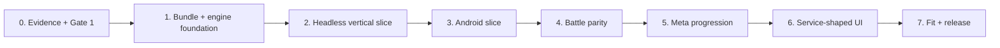

# MySD Implementation Roadmap

Status: Phase 0 in progress; Gate 1 blocked on Luna crawl

## Dependency flow

## Phase 0 — Repository and evidence

Deliver:

- public-safe repository, composite build, pinned engine SHA, CI;
- Luna runbook, local corpus layout, capture metadata, graph schema, claim ledger;
- complete crawl and Gate 1 inventory.

Exit:

- all root routes reached;
- core loop terminal state captured;
- no unmatched affordance;
- positive/negative states captured;
- six-iteration discovery plateau;
- all inference below 0.8 in open questions;
- human accepts inventory, scope, and mandatory deviations.

## Phase 1 — Specification and engine foundation

Deliver:

- full production/reference bundle with EARS, stories, Gherkin, design, quality artifacts,
  per-state fit checklists, traceability, deviations, economy/progression model;
- evaluator pass and human Gate 2;
- ADR-0004/PROC-002 accepted;
- ENG-036 implemented as Android-free reusable runtime/session;
- critical accepted engine gaps implemented in dependency order;
- MySD engine pin updated after every accepted engine change.

Exit:

- 100% accepted FR/US/AC traceability;
- zero orphan states and unmatched affordances;
- engine gaps have evidence/confidence and no duplicates;
- Gate 2 accepted.

## Phase 2 — Headless battle vertical slice

Deliver one original stage with:

- one base;
- one production building;
- one allied unit;
- one enemy family;
- one enhancement choice;
- victory and defeat.

Order:

1. content schema and invalid fixtures;
2. JVM commands/session/scenario;
3. replay golden;
4. arbitrary-tick save/restore and migration;
5. balance/load report.

Exit: identical per-tick hashes for same seed/commands, both terminal states, roundtrip/migration pass.

## Phase 3 — Android vertical slice

Deliver Pixel 9 shell for the headless slice:

- immutable snapshot rendering;
- touch-to-command input;
- fixed 20 Hz loop / 60 FPS target;
- pause/background/recreate/process-death restore;
- first structural fit checklist.

Exit: Android assemble, navigation smoke, lifecycle tests, manual device smoke, no authoritative
state in Activity/View.

## Phase 4 — Battle parity

Add accepted buildings, allied/enemy families, waves, bosses, modifiers, pause/speed, and reward flow
one content family at a time. Each family adds content validation, deterministic scenario coverage,
replay/save updates, balance delta, performance delta, and fit states.

Exit: all in-scope battle nodes/edges pass; critical timings are within ±15% where confidence >=0.8.

## Phase 5 — Meta progression

Implement accepted campaign stages/map, energy, currencies, Troops, Tech, unlocks, claim, and sweep.
Keep profile store separate from run save.

Exit:

- locked/unlocked, affordable/unaffordable, energy available/empty, and claim states covered;
- run/profile migration matrix and process-death transitions pass;
- economy has no untraced mutation.

## Phase 6 — Service-shaped UI

Implement rewarded, IAP, and Arena interfaces plus deterministic local fakes. Preserve observed
affordance and guard shape without production SDKs, real payments, accounts, or backend.

Exit: every service edge is local, blocked, or an explicit deviation; network dependency scan passes.

## Phase 7 — Fit and release

Luna repeats the registry tour on MySD. Sol compares states in two passes:

1. structure/semantics/bounds/timing;
2. masked visual composition and original creative regions.

Every unexplained divergence becomes a SPEC, then build → capture → compare repeats.

Release gate:

- behavior/must-match rows pass;
- per-state structural score >=90%;
- key bounds ±4 dp;
- Pixel 9 p95 <=16.7 ms, jank <5%;
- load at observed max concurrency +25%;
- public-safety history gate passes;
- release tag records exact MyEngine SHA.

## Commit policy

Human reviews the diff at each gate. Accepted MySD changes may commit directly to `main`. MyEngine
changes follow the MyEngine pipeline in their own accepted feature runs; MySD updates its lock only
after those commits are available remotely.
