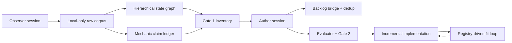

# Evidence-First Reference Reimplementation Playbook

Status: project-local process v1

## Pipeline

## Reusable rules

1. Separate observer and author sessions. Observation records actions and evidence; authoring creates
   product decisions and requirements.
2. Keep raw third-party evidence local. Public repositories receive hashes, measurements, semantic
   summaries, confidence, and trace links only.
3. Model screen, overlay, phase, and meta state separately in one hierarchical graph.
4. Deduplicate with structural, masked-visual, and semantic signatures. Treat volatile values as
   observations.
5. Keep hidden-rule hypotheses in a contradiction-preserving claim ledger. Require controlled
   variables and samples before promotion.
6. Gate inventory before requirements/backlog bridge; gate evaluated traceability before code.
7. Deduplicate engine gaps before raising game demand. Game-specific content/layout/balance remains
   in the game repository.
8. Fit from a state registry, not a folder of screenshots. Every state has a setup driver, evidence,
   checks, deviations, and owner.

## Process improvements adopted for MySD

### Decision lineage

Use a continuous chain:

`EV -> OB/ED -> CL -> INV -> FR -> US -> AC -> GAP/ENG -> TEST -> FIT`.

Missing links are mechanical blockers. Confidence stays on evidence/claims; scope priority stays on
inventory/requirements. Do not collapse the two.

### Contradiction-first experiments

For a hidden rule, Luna first records a hypothesis and the easiest observation that could falsify
it. Repeated identical play without controlled-variable changes increases sample count but does not
justify high confidence by itself.

### Evidence delta runs

Fingerprint package version, device profile, locale, graph schema, and raw hashes. A later crawl
revisits only changed/low-confidence/uncovered branches, while retaining prior evidence and
contradictions.

### Two-pass fit

Pass A checks route, hierarchy, affordances, guards, bounds, and timings. Pass B checks masked visual
composition. This prevents original-IP areas from hiding structural regressions and prevents pixel
similarity from overriding wrong behavior.

### Coverage and confidence are separate

A graph can have broad coverage with low confidence, or narrow coverage with high confidence. Gate
reports show both. Plateau is accepted only after six iterations with no new state, affordance, or
claim and no unmatched visible element.

### Backlog bridge budget

Before creating an ENG card, estimate module/file touch. More than three modules or roughly twelve
production files forces decomposition. Each card owns deterministic order, save/replay impact,
schema, performance gate, evidence, and trace links.

### Public-safety from day zero

Create the ignored raw root and history-scanning gate before the first capture. Do not rely on
cleanup after evidence has entered history.

## Human gates

- Gate 1: inventory, scope, deviations, blockers.
- Gate 2: evaluated bundle, residual gaps, risks, implementation handoff.
- Engine acceptance: each reusable capability and new pin.
- Release: behavior, fit, performance, migration, public history.
