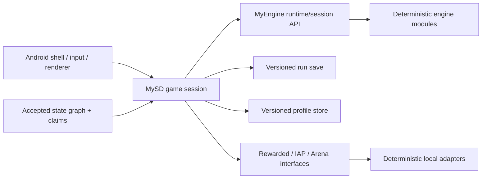

# Design

Status: **architecture baseline; navigation/gameplay sections await Gate 1**

## System boundary

The Android shell owns lifecycle, frame pacing, gesture translation, and drawing. The game session
owns game-specific orchestration and translates user intent into engine commands. MyEngine owns
reusable deterministic systems. Neither renderer nor input mutates simulation state directly.

## State model

Reference navigation uses `spec/evidence/state-graph.v1.json`. The implementation registry maps
each accepted reference node to:

- MySD route/state ID;
- required semantic flags;
- setup fixture/driver;
- structural/behavioral assertions;
- intended deviations and IP masks.

The hierarchy separates route screens, overlays, battle phases, and meta states. HP, currency,
energy, wave, and timers are observations and do not multiply state nodes.

## Persistence

- `RunSaveV1+`: active battle state, pending commands, deterministic RNG state/seed, selected
  stage/content versions, run modifiers, and terminal result.
- `ProfileStoreV1+`: campaign unlocks, currencies, energy policy state, roster/loadout, tech,
  claims, and local service history.
- Both formats reject unknown future versions, migrate supported historical versions, and never
  serialize Android views or renderer state.

## Services

Interfaces are game-side:

- `RewardedOpportunityService`;
- `PurchaseCatalogService`;
- `ArenaService`.

The first-release implementations are deterministic local fakes configured by fixtures. Any
reference guard that requires a real service maps to `service_adapter` or `blocked` in the state
graph and to an explicit deviation.

## Content

Game-specific content stays in MySD. Flat scalar definitions use reviewed data files; nested stage
layouts, tech DAGs, and modifier pools use structured versioned schemas consistent with MyEngine
ADR-0003. Content IDs, not display text, enter saves and replay traces.

## Pending sections

Gate 1 must supply the accepted navigation graph, battle command vocabulary, economy transitions,
stage progression, roster/loadout behavior, tech semantics, reward flow, and terminal-state rules.

---
*Сгенерировано `/mp-spec`-совместимым процессом (mode `clone`, depth `reference`, platform
`android`). Handoff заблокирован до Gate 2.*
