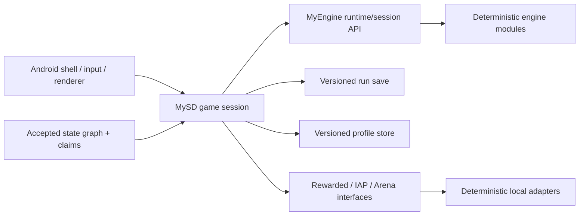

# Design

Status: **full-product human decision active; integrated implementation in progress**

## System boundary

The Android shell owns lifecycle, frame pacing, gesture translation, and drawing. The game session
owns game-specific orchestration and translates user intent into engine commands. MyEngine owns
reusable deterministic systems. Neither renderer nor input mutates simulation state directly.

## State model

Reference navigation uses `spec/evidence/state-graph.v1.json`. The implementation registry maps
each accepted reference node to:

- MySD route/state ID;
- required semantic flags;
- setup fixture/driver;
- structural/behavioral assertions;
- intended deviations and IP masks.

The hierarchy separates route screens, overlays, battle phases, and meta states. HP, currency,
energy, wave, and timers are observations and do not multiply state nodes.

The fit registry records accepted semantic nodes and the excluded external Back node. Shop and Tech
were promoted by the 2026-09-16 human decision; behaviors not directly observed remain explicitly
original MySD design rather than reference claims.

## Persistence

- `RunSaveV1+`: active battle state, pending commands, deterministic RNG state/seed, selected
  stage/content versions, run modifiers, and terminal result.
- `ProfileStoreV1+`: campaign unlocks, currencies, energy policy state, roster/loadout, tech,
  claims, and local service history.
- Both formats reject unknown future versions, migrate supported historical versions, and never
  serialize Android views or renderer state.

## Services

Interfaces are game-side:

- `RewardedOpportunityService`;
- `PurchaseCatalogService`;
- `ArenaService`.

The first-release implementations are deterministic local fakes configured by fixtures. Any
reference guard that requires a real service maps to `service_adapter` or `blocked` in the state
graph and to an explicit deviation.

## Content

Game-specific content stays in MySD. Flat scalar definitions use reviewed data files; nested stage
layouts, tech DAGs, and modifier pools use structured versioned schemas consistent with MyEngine
ADR-0003. Content IDs, not display text, enter saves and replay traces.

## Full-product session

Android consumes one `MySdAppSession` façade with four transport-neutral operations:

- `snapshot()` returns the immutable route, profile, battle, service, and feedback projection;
- `submit(intent)` performs one typed atomic user transition;
- `pulse()` advances fixed authoritative ticks according to the selected presentation speed;
- `saveBundle()` emits independent versioned run/profile payloads.

`MySdAppSession` is the only coordinator allowed to settle battle rewards into the profile. The
MyEngine `engine-runtime` API remains behind the game module; Compose never imports it.

## Battle order

Every active tick uses a stable integer-only order: commands, passive supply/cooldowns, spawns,
hostile movement/attacks/leaks, allied movement/attacks, tower attacks/support, deaths/rewards,
wave transition, choice/terminal evaluation. Entity and target tie breaks use stable IDs. Choice,
paused, and terminal phases are tick identities. Presentation speed determines how many fixed ticks
the Android pulse requests and never changes reducer semantics.

Immediate player commands use a game-owned command-only boundary at the current logical tick.
MyEngine drains already-due commands in canonical order; MySD applies their direct costs/effects
without advancing income, movement, attacks, or cooldowns. Future commands remain saveable. Thus
pause/resume and enhancement selection work while the ticker is frozen, and repeated input cannot
accelerate the 20 Hz simulation.

## Meta transaction order

All energy, currency, reward, upgrade, claim, Shop, and sweep mutations pass through an atomic
profile reducer. A successful mutation appends a stable ledger entry containing sequence, reason,
resource deltas, and resulting balances; rejection returns the exact input profile plus a typed
reason. Loadouts and technology prerequisites are validated before any cost is applied.

## Android composition

The production shell separates home/campaign, setup, battle, roster, technology, Shop, reward
track, settings, Arena, and terminal surfaces into bounded composables. The existing
`CampaignScreen` API remains a compatibility façade for prior semantic tests. Lifecycle collection
owns the ticker and persistence callbacks, while all gameplay state stays in `:game`.

Presentation feedback is local and non-authoritative: original procedural PCM effects/music and
system haptic feedback honor the persisted sound/music/haptic preferences and stop outside the
RESUMED lifecycle. No external audio files, synthesis services, or reference samples are consumed.

---
*The original relaxed Gate 2 bundle was extended by an explicit human product decision on
2026-09-16. That extension authorizes original implementation scope, not unobserved parity claims.*
